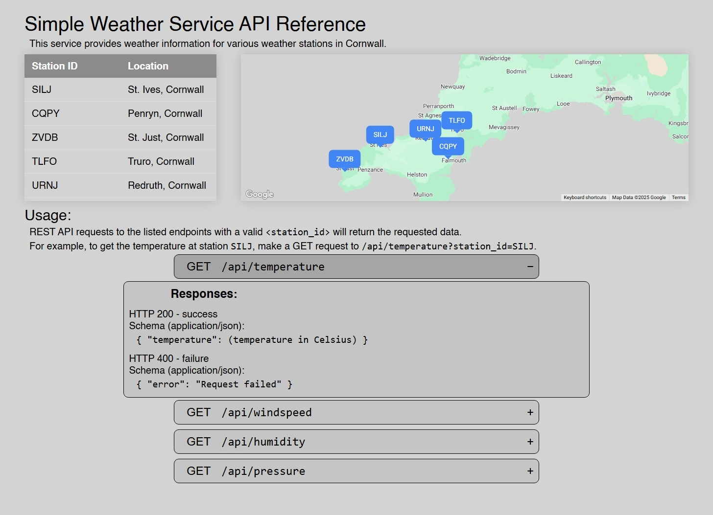

# Simple Weather Service
A weather service hosted on AWS serving users with static and dynamic content. 
https://wp71kyut29.execute-api.eu-west-2.amazonaws.com/prod

Requests made to an appropriate API endpoint result in a 200 response code with the requested data:

...or a 400 response code and failure message with additional debug information:

## Introduction
After experimentation with several AWS services, a serverless implementation was selected based on:
- AWS API Gateway
- AWS S3
- AWS Lambda

#### AWS API Gateway
- Handles access requests (is the main URL for client requests), routing them to the appropriate AWS service.
- Manages rate limiting and throttling.
- Enables deployment of muiltiple stages with authentication features for development builds.

#### AWS S3
- Hosts static content like HTML, CSS and JavaScript.

#### AWS Lambda
- Handles and interprets API access requests.
- Formats and returns requested information to clients.

## AWS API Gateway
Four resources are defined to handle hosting of static content and proper fielding of API requests (through AWS Lambda).

~~~
/             - Usage webpage
/{proxy+}     - Usage webpage (supporting files)
/api          - API root (redirects to usage webpage)
/api/{proxy+} - Weather API
~~~

Methods within those API Gateway resources are then configured to handle **only** HTTP GET requests. Requests of any other type will be denied.

~~~
/             - GET → AWS integration with S3
/{proxy+}     - GET → AWS integration with S3
/api          - GET → Mock integration (internal)
/api/{proxy+} - GET → Lambda integration
~~~

## Frontend
Static HTML content is hosted in an AWS S3 bucket. As the API Gateway is used to route GET requests directly to AWS S3 (on the cloud side), public access to the bucket can remain disabled for enhanced security.

The webpage features several components aimed at enhancing the user experience and allowing for understanding of the capabilities of the API:
- A list of available weather stations. (Clicking on a row automatically pans/zooms to the station.)
- Integration of a Google Maps map showing Cornwall and weather stations located in the area.
- A simple introduction to usage of the API including an example request.
- Expandable (by clicking) API endpoint descriptors detailing:
  - available endpoints,
  - and the JSON information returned (on success/failure).

The Chromium DevTools suite (in Microsoft Edge) was a crucial development aid for debugging, testing and supporting design decisions made as part of the frontend application design.

## Backend
Any requests to `/api` endpoints are routed to an AWS Lambda function running Python. This function interacts with a DynamoDB instance containing all available weather data (from all stations).

### AWS Lambda
An AWS Lambda function serves as the backend compute layer and content provider for the API. Requests are processed by the function where validation of user input is carried out alongside handling of success and failure responses.

The JSON response for successful requests send to valid API endpoints is formed and returned in the Lambda function.

An additional benefit of hosting the API backend inside a Lambda function is the automatic parsing of headers and request content. In traditional hosting setups, the responsibility for handling the complete request can result in additional security risks being taken on by the developer.

### DynamoDB
The DynamoDB instance stores weather data received from weather stations. It is the primary data source for all API endpoints, and is typically queried to receive the latest set of weather data receieved from the selected station.

DynamoDB was chosen over AWS RDS (Relational Database Service) as its serverless nature better supports the dynamic scaling offered by AWS Lambda. Support for more advanced querying was not required for the simple weather service application. 

## Testing
Testing took the form of several guises during project development. The combination of several test components helped to minimise the risk of publishing broken/breaking changes to the AWS environment.

### Local Hosting
Compared to running applications locally, cloud hosting introduces additional delays related to uploads and any requirement for the re-provisioning of application resources.

To mitigate any related delays, early development iterations were first run in a local Python instance acting as a sandbox/testbed to prove changes before publication.

### Automated Testing
Several test scripts were prepared to carry out automatic testing of application functionality using Python's `unittest` testing framework. Automated tests were run before committing changes to the codebase or publishing updates to AWS.

### Data Synthesizing
As the collation of live weather data was not feasible, an AWS Lambda utility function was created to populate the DynamoDB `wx-serv-data` table with synthetic data. It was important to test the application with a range of database states.

## Future Improvements and Known Issues

### Weather Stations
Weather stations are currently hard-coded in the frontend and backend applications. This could become difficult to maintain if the quantity of data-providers is expected to change.

Better validation of user input is also required. Requests for weather stations that do not exist will crash the application. (It is wrongly assumed that users will only request weather stations listed in the usage table.)

### Database Edge Cases
Currently, API requests with empty database tables are likely to crash the application (AWS Lambda function). Checks should be added to ensure the validity and existence of data in database tables.

### Adaptive CSS
Although some effort has been made to optimise the frontend experience for various devices, further scope could be given to refining the user experience to support a wider range of device scenarios.